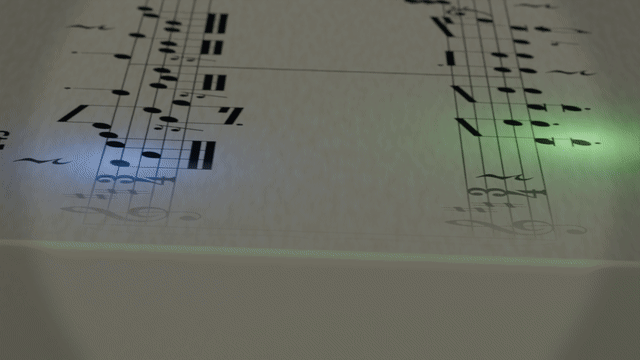

# Blender Music Score Visualization

Reusable Codex Skill for turning MIDI, MusicXML, or score assets into Blender music visualizations.

It covers synchronized hopping balls, multi-note convergence, comet trails, readable score engraving, stable score-axis camera tracking, Cycles materials, DOF, preview rendering, and final H.264/AAC export.

## Animated Example

The repository includes a three-second GIF preview rendered from the workflow below:



The sample shows the warm score surface, two glowing voice balls, score-axis camera movement, and the short comet trail. GIF has no audio; use the MP4 commands below for sound.

## Quick Start

This example assumes:

- Blender 5.1 is installed at `E:\blender-5.1.0-windows-x64\blender.exe`.
- The current scene already contains `chase_cam` and `note_cloud`.
- FFmpeg is installed at `C:\ffmpeg\bin\ffmpeg.exe`.
- The score audio is a WAV file.

Set your own paths first:

```powershell
$Blender = "E:\blender-5.1.0-windows-x64\blender.exe"
$Skill = "$env:USERPROFILE\.codex\skills\blender-music-score-visualization"
$Source = "D:\score-project\score_scene.blend"
$Matched = "D:\score-project\score_scene_matched.blend"
$Frames = "D:\score-project\preview_frames"
$Audio = "D:\score-project\performance.wav"
$Preview = "D:\score-project\preview.mp4"
```

Inspect the scene before changing it:

```powershell
& $Blender -b -P "$Skill\scripts\inspect_scene.py" -- --blend $Source
```

Create a stable score-axis camera track and save a new scene:

```powershell
& $Blender -b -P "$Skill\scripts\match_camera_track.py" -- `
  --source $Source `
  --output $Matched `
  --preview-dir "D:\score-project\camera-stills" `
  --preview-frames "120,1000,2000"
```

Render a short five-second review at 1280x720:

```powershell
& $Blender -b -P "$Skill\scripts\render_sequence.py" -- `
  --blend $Matched `
  --frames-dir $Frames `
  --start 1 --end 150 `
  --width 1280 --height 720 --fps 30
& "$Skill\scripts\merge_sequence.ps1" `
  -FramesDir $Frames `
  -EndNumber 150 `
  -Audio $Audio `
  -Output $Preview
```

After approving the preview, render the complete scene at 1920x1080 and encode it:

```powershell
$FullFrames = "D:\score-project\full_1080p_frames"
$Final = "D:\score-project\score_visualization_1080p.mp4"
& $Blender -b -P "$Skill\scripts\render_sequence.py" -- `
  --blend $Matched `
  --frames-dir $FullFrames `
  --width 1920 --height 1080 --fps 30
& "$Skill\scripts\merge_sequence.ps1" `
  -FramesDir $FullFrames `
  -EndNumber 4664 `
  -Audio $Audio `
  -Output $Final
```

The `4664` value is only an example. Use the actual last frame printed by `inspect_scene.py`.

## Example Project Layout

```text
score-project/
|-- score_scene.blend
|-- performance.wav
|-- notes.csv
|-- score.png or score.pdf
|-- camera-stills/
|-- preview_frames/
`-- full_1080p_frames/
```

The `.blend` should contain a readable score surface, `note_cloud`, `ball_src`, and an active camera. If the scene is not built yet, first use the project-specific Blender build script to import the score data and create the geometry-node animation; this Skill then handles the camera, material, preview, and export stages.

## Install

Copy this folder into the Codex skills directory:

```text
%USERPROFILE%\.codex\skills\blender-music-score-visualization
```

Invoke it explicitly with:

```text
$blender-music-score-visualization
```

The helper scripts are intended to run through Blender's Python interpreter. See `references/` for the workflow and export contract.

For the detailed decision rules, read [SKILL.md](SKILL.md), [camera-sync.md](references/camera-sync.md), and [export.md](references/export.md).

## License

MIT. See [LICENSE](LICENSE).
